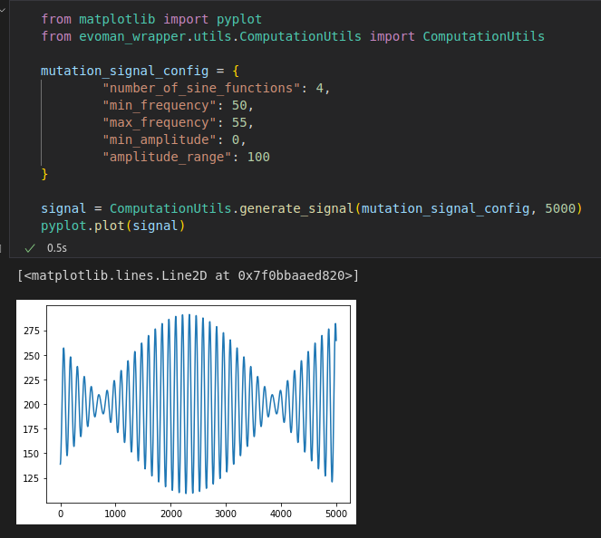
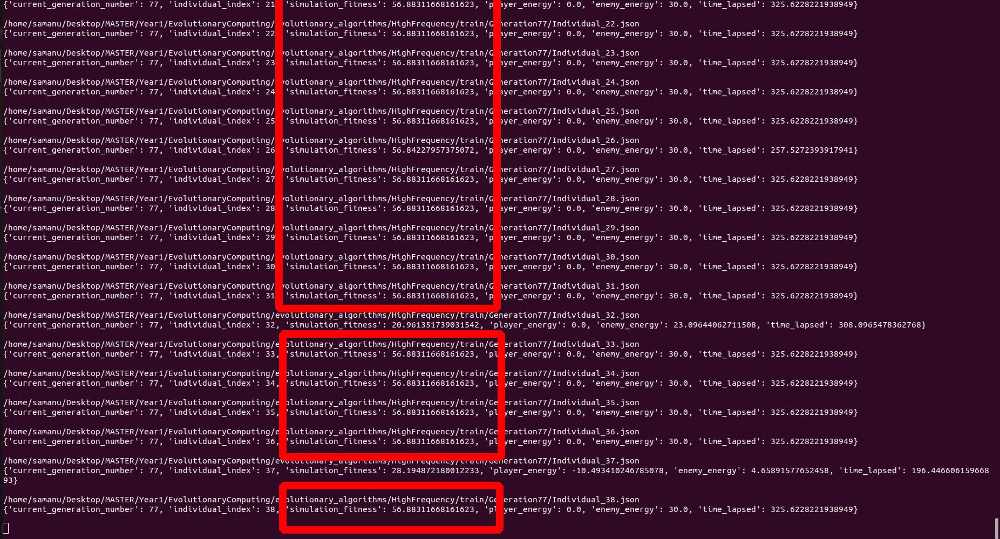
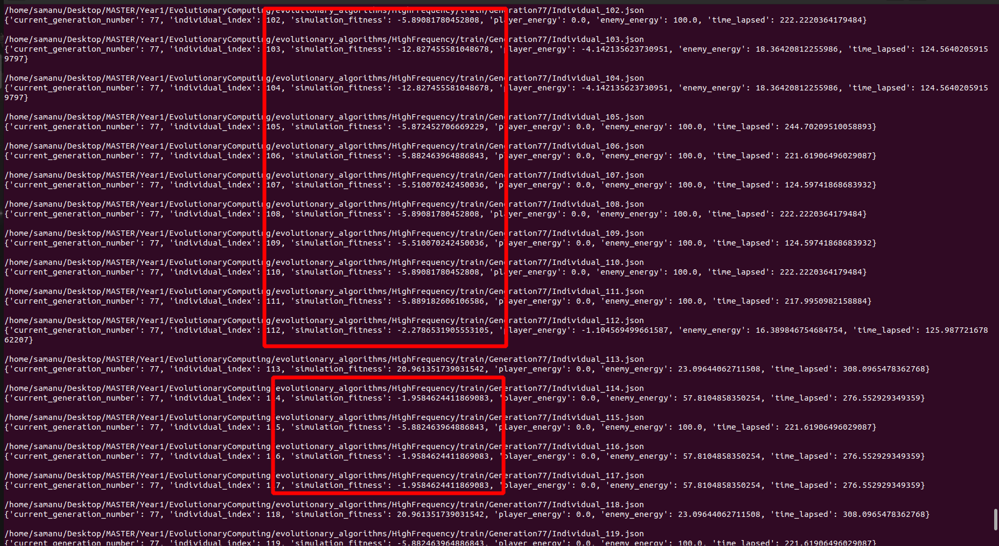

# 1. Improvements on evoman_wrapper

## Configurable random signal generation capabilities



## Loading and storing state of experiment

```
# Will dump state in ./{ExperimentName}/train/dump.json
EvomanWrapper.__dump_state()

```

```
# Will load state from ./{ExperimentName}/train/dump.json
EvomanWrapper.__load_state()

```

# 2. Evolutionary Algorithm 3

- Selection:
  - Roulette Wheel Selection
- Mutation:
  - Using random signal with following config:
    - ```
        {
            "number_of_sine_functions": 10,
            "min_frequency": 400,
            "max_frequency": 500,
            "min_amplitude": -0.01,
            "amplitude_range": 0.02
        }
      ```
- Crossover:

  - Using random signal with following config:

    - ```
        {
            "number_of_sine_functions": 10,
            "min_frequency": 0,
            "max_frequency": 500,
            "min_amplitude": -0.01,
            "amplitude_range": 0.02
        }
      ```

  - Two random parents:

    - ```
      childGenome = signalPositive \
        ? genomeFromMother \
        : genomeFromFater
      ```

- Group A Overview

  - Losing diversity probably due to the Roulette Wheel Selection (Same individual)

    - 

  - Aggressive mutation usually destroys quality (Negative fitnesses)
    - Who is the responsible?
      - The frequency band?
      - The amplitude?
    - 
